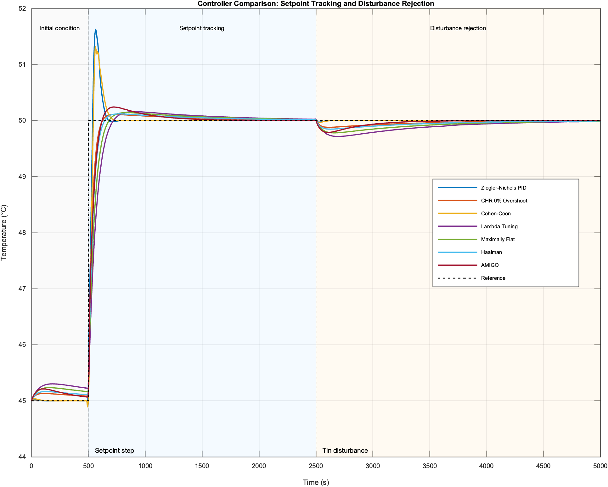
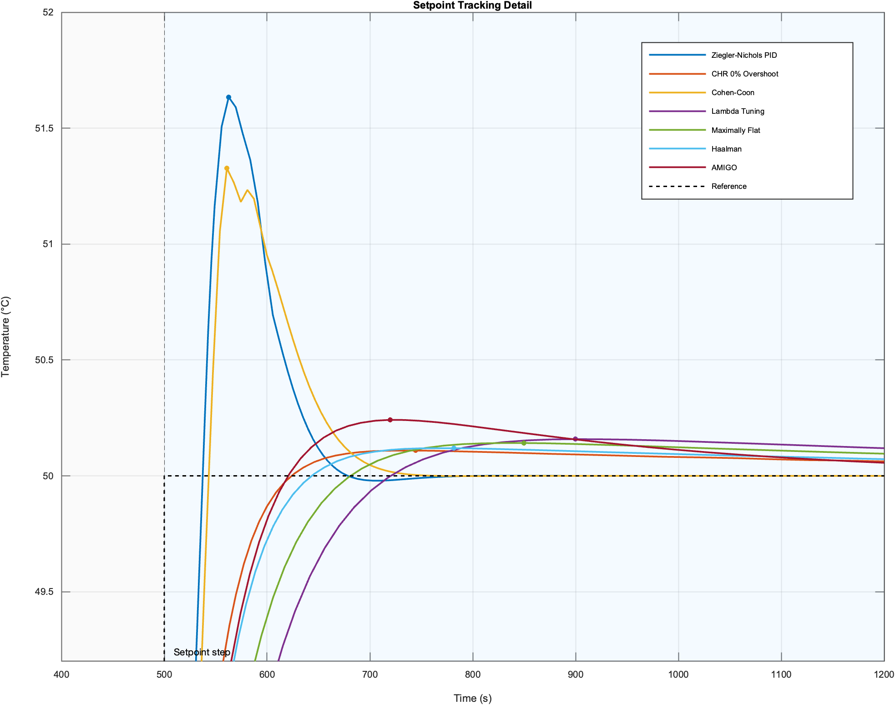
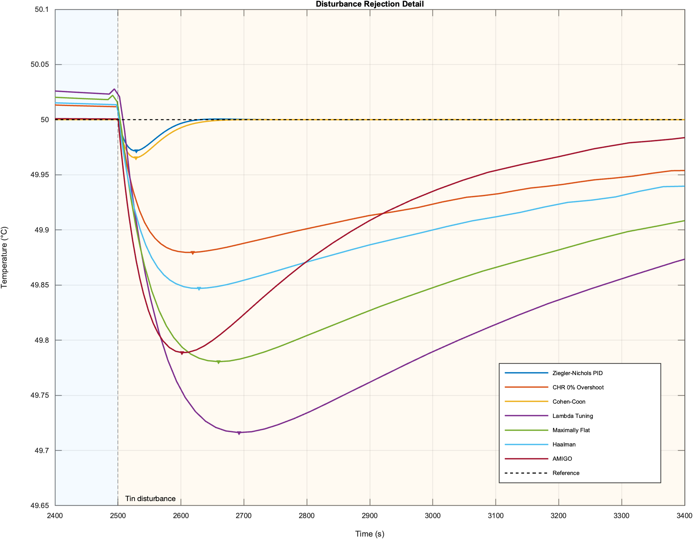
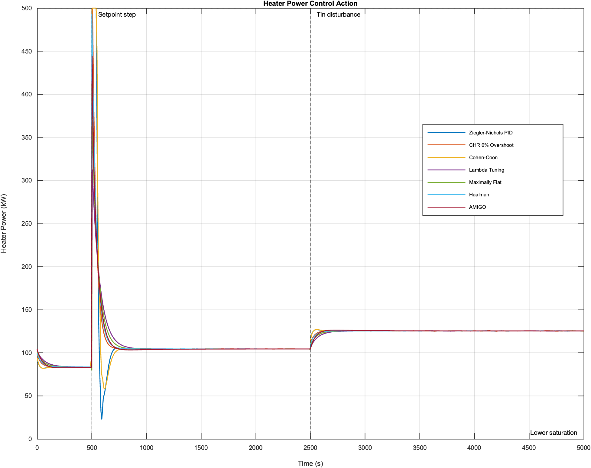
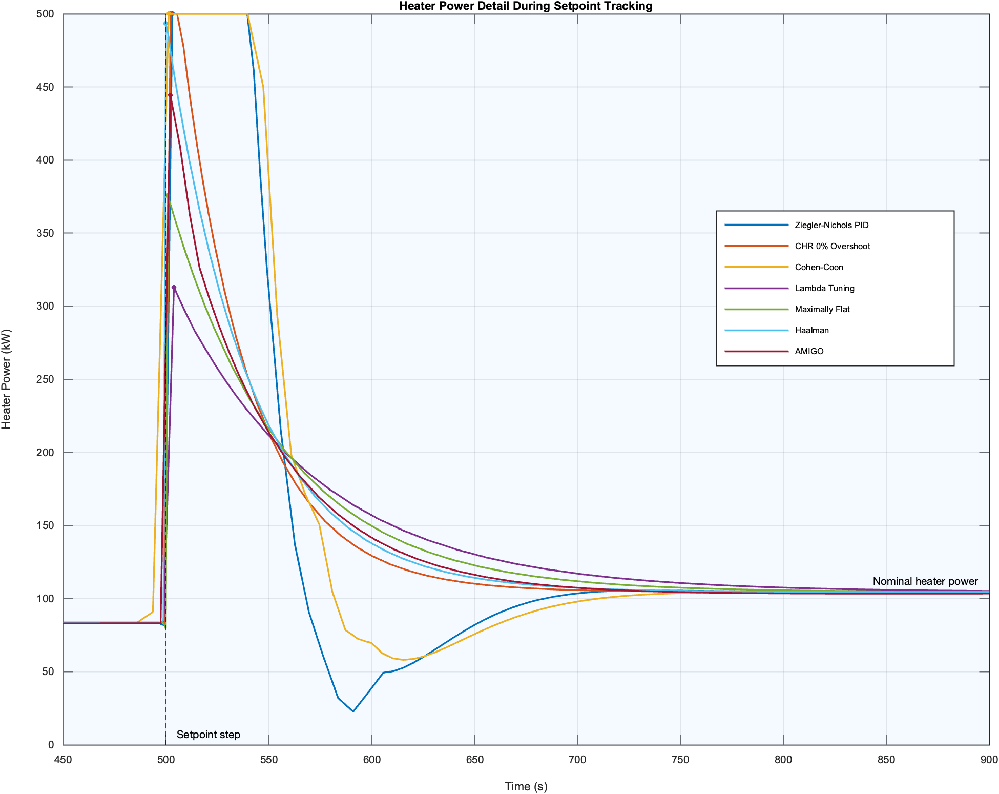
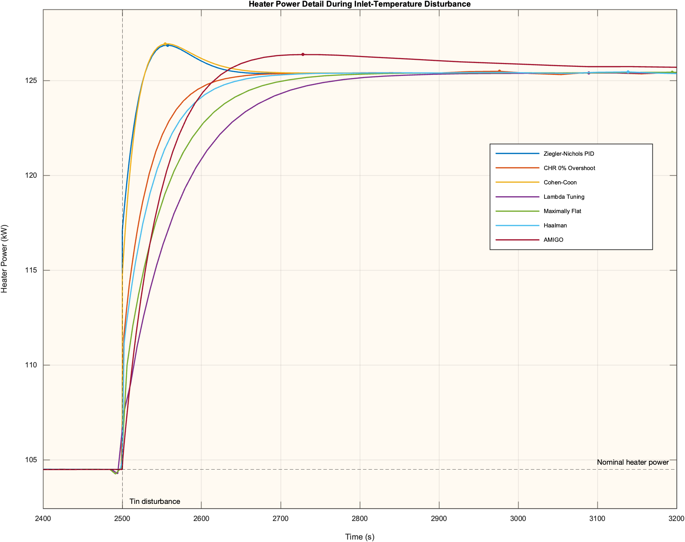

# MIMO Tank Level and Temperature Control Using Classical PID Tuning Methods

A MATLAB-based control systems project for modeling, linearizing, and controlling a nonlinear stirred-tank process with coupled level and temperature dynamics.

## Overview

This project studies a two-input two-output industrial tank system. The controlled outputs are liquid level and tank temperature. The manipulated inputs are inlet flow rate and heater power.

The project includes nonlinear process modeling, linearization around an operating point, feedforward decoupling, PI/PID controller design, nonlinear simulation, and comparison of classical PID tuning methods.

## Main Features

- Nonlinear MIMO tank model based on mass and energy balance
- Linearized transfer-function representation
- Feedforward decoupling for loop interaction reduction
- Classical PID tuning methods: Ziegler-Nichols, CHR, Cohen-Coon, Lambda, Maximally Flat, Haalman, and AMIGO
- Nonlinear closed-loop simulation using `ode45`
- Automatic export of comparison figures and metrics

## Repository Structure

```text
mimo-tank-pid-control/
├── README.md
├── .gitignore
├── requirements.md
├── src/
│   ├── main.m
│   ├── compare_pid_methods.m
│   ├── analyze_anti_windup.m
│   ├── config/
│   ├── controllers/
│   ├── models/
│   ├── simulation/
│   ├── visualization/
│   └── legacy/
├── figures/
│   ├── controller_temperature_comparison.png
│   ├── setpoint_tracking_zoom.png
│   ├── disturbance_rejection_zoom.png
│   ├── heater_power_comparison_kw.png
│   ├── heater_power_setpoint_zoom.png
│   └── heater_power_disturbance_zoom.png
│
└── results/
    └── controller_comparison_metrics.csv
```

## Usage

Open MATLAB in the repository root and run:

```matlab
run("src/main.m")
```

This runs the controller comparison and saves:

- `figures/controller_temperature_comparison.png`
- `figures/setpoint_tracking_zoom.png`
- `figures/disturbance_rejection_zoom.png`
- `figures/heater_power_comparison_kw.png`
- `figures/heater_power_setpoint_zoom.png`
- `figures/heater_power_disturbance_zoom.png`
- `results/controller_comparison_metrics.csv`

To run the Lambda anti-windup comparison:

```matlab
analyze_anti_windup()
```

## Notes

The `src/legacy/` folder contains the original project scripts. The cleaned implementation uses modular functions and parameter structures instead of duplicated script logic and global variables.


## Results

The cleaned MATLAB implementation automatically runs all controller simulations, saves the comparison metrics to `results/controller_comparison_metrics.csv`, and exports the response plots to the `figures/` directory.

The evaluated scenario includes:

1. A temperature setpoint step from `45°C` to `50°C` at `t = 500 s`.
2. An inlet-temperature disturbance from `25°C` to `20°C` at `t = 2500 s`.
3. Closed-loop comparison of seven classical PID tuning methods.

### Quantitative Controller Comparison

| Controller | Peak Temp. (°C) | Overshoot (°C) | Disturbance Min. (°C) | Disturbance Dip (°C) | Settling Time (s) | Final Temp. (°C) |
|---|---:|---:|---:|---:|---:|---:|
| Ziegler–Nichols PID | 51.634 | 1.634 | 49.972 | 0.028 | 154.24 | 50.000 |
| CHR 0% Overshoot | 50.109 | 0.109 | 49.880 | 0.120 | 2312.00 | 49.994 |
| Cohen–Coon | 51.327 | 1.327 | 49.965 | 0.035 | 181.57 | 50.000 |
| Lambda Tuning | 50.158 | 0.158 | 49.716 | 0.284 | 3118.50 | 49.984 |
| Maximally Flat | 50.142 | 0.142 | 49.781 | 0.219 | 2858.10 | 49.991 |
| Haalman | 50.119 | 0.119 | 49.847 | 0.153 | 2522.10 | 49.993 |
| AMIGO | 50.242 | 0.242 | 49.789 | 0.211 | 2398.30 | 50.000 |

### Visual Results

#### Full Temperature Response



This plot shows the complete closed-loop simulation, including the initial condition, setpoint-tracking interval, and disturbance-rejection interval.

#### Setpoint Tracking Detail



This zoomed plot highlights the response after the temperature setpoint changes from `45°C` to `50°C`.

#### Disturbance Rejection Detail



This zoomed plot shows how each controller reacts when the inlet temperature drops from `25°C` to `20°C`.

#### Heater Power Response



This plot compares the heater power control action for all tuning methods. The power is shown in kilowatts for readability.

#### Heater Power During Setpoint Tracking



This zoomed plot shows actuator effort during the setpoint-tracking phase.

#### Heater Power During Disturbance Rejection



This zoomed plot shows how the controllers increase heater power to compensate for the inlet-temperature disturbance.

## Discussion

The results show a clear trade-off between response speed, overshoot, disturbance rejection, and actuator effort.

Ziegler–Nichols PID achieved the fastest settling time among the tested methods, with a settling time of approximately `154.24 s`. However, it also produced the largest overshoot, reaching a peak temperature of `51.634°C`, corresponding to an overshoot of `1.634°C`.

Cohen–Coon also produced a fast response, with a settling time of approximately `181.57 s`, but it remained aggressive and reached a peak temperature of `51.327°C`.

CHR 0% Overshoot produced the smallest overshoot among the tested methods, with only `0.109°C` overshoot. However, this came at the cost of a much longer settling time of approximately `2312 s`.

Lambda tuning, Maximally Flat, Haalman, and AMIGO produced smoother responses with relatively low overshoot, but their settling times were longer than Ziegler–Nichols and Cohen–Coon. Among these smoother methods, Haalman showed a balanced response with low overshoot and moderate disturbance rejection.

For disturbance rejection, Ziegler–Nichols PID and Cohen–Coon showed the smallest temperature dips after the inlet-temperature disturbance. Lambda tuning showed the largest disturbance dip for the selected value of λ, indicating slower recovery under this configuration.

Overall, the comparison demonstrates that no single tuning method is universally best. The appropriate controller depends on the design objective:

- Use aggressive tuning when fast tracking is more important.
- Use conservative tuning when overshoot reduction and smooth actuator behavior are more important.
- Evaluate actuator effort alongside temperature response, especially for industrial systems with physical saturation limits.
## Requirements

This project requires MATLAB and the Control System Toolbox.

For full environment details, see [`requirements.md`](requirements.md).

## License

This project is licensed under the terms provided in the [`LICENSE`](LICENSE) file.

## Author

Raha Sajed

Electrical Engineering / Control Systems
